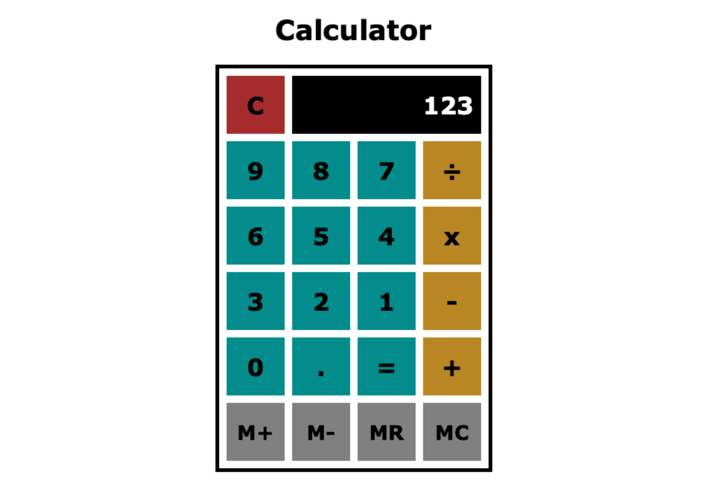

# Classic Calculator

 

_A calculator with basic functions made with Javascript._

 

See it in action [here](https://naturalnick.github.io/calculator-js/).

 

Screenshot: 

## Summary

This was a fun and challenging project. There are lots of parts at play and it was cool to see them all fall into place.

Features:

- Add, subtract, divide and multiply any two numbers together
- Continued operations (eg. 1+2+3+4=10)
- Memory support to save numbers for future use
- Clear button to start from scratch
- Supports negatives and decimals

_Does not yet support exponents or numbers over 10 billion._

What I learned:

- How to reorganize my code in a much cleaner way
- How to use CSS flexbox effectively
- How to use calculator memory buttons (I'd never used them before!)

## Author

- **Nick Schaefer** - _Full-Stack Software Developer_ - [Website](https://nschaefer.com/) | [LinkedIn](https://www.linkedin.com/in/nick-n-schaefer)
